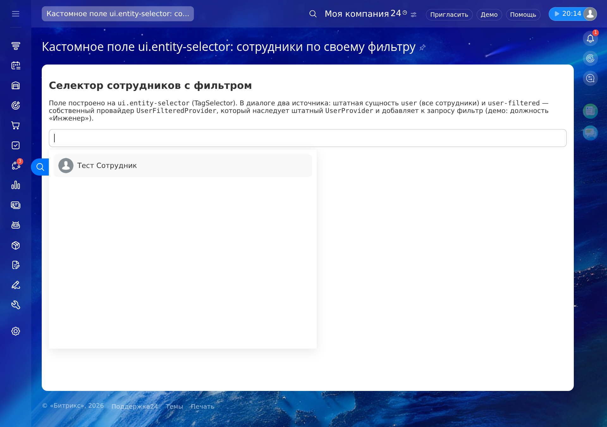

# Bitrix24: кастомное поле ui.entity-selector с сотрудниками по своему фильтру

Репозиторий-пример, как сделать своё поле выбора сотрудников на `ui.entity-selector` (TagSelector), где список отфильтрован вашим условием: штатные отделы, должности, активность — любой фильтр по полям пользователя.

## Пример отображения



## Как это устроено

Кастомное поле = JS-обёртка над `TagSelector` + провайдер данных для `ui.entity-selector`:

| Файл | Назначение |
|------|------------|
| `local/modules/mtai/lib/integration/ui/entityselector/userfilteredprovider.php` | `UserFilteredProvider` — наследует штатный `Bitrix\Socialnetwork\Integration\UI\EntitySelector\UserProvider` и добавляет фильтр к запросу выборки (`getUserFilter()`) |
| `local/modules/mtai/.settings.php` | Регистрация сущности `user-filtered` → провайдер (секция `ui.entity-selector`) |
| `local/js/mtai/filtered_user_selector/` | JS-расширение: `BX.Mtai.FilteredUserSelector.Init()` — TagSelector с синхронизацией выбранного в скрытое поле формы |
| `local/php_interface/autoload.php` | Автозагрузка класса провайдера (неймспейс `MTai\*` не соответствует ID модуля — без регистрации ui.entity-selector молча отбрасывает сущность) |
| `example/index.php` | Страница-пример: скрытый input + селектор с предвыбранным текущим пользователем |

### Провайдер

`UserProvider` (модуль socialnetwork) уже умеет всё штатное: структура компании, аватары, поиск, недавние. `UserFilteredProvider` переопределяет один метод `getQuery()`:

```php
protected const USER_FILTER = [
    'WORK_POSITION' => 'Инженер', // демо-фильтр — замените на свой
];

protected static function getQuery(array $options = []): Query
{
    $query = parent::getQuery($options);
    foreach (static::getUserFilter() as $column => $value) {
        $query->where($column, $value);
    }
    return $query;
}
```

Ключи `USER_FILTER` — поля таблицы `b_user` (`WORK_POSITION`, `ACTIVE`, `EMAIL`, ...); фильтр выполняется на сервере, из JS подменить его нельзя. Демо-фильтр: должность «Инженер».

### JS

`TagSelector` создаётся с двумя сущностями — можно комбинировать со штатным списком сотрудников:

```js
BX.Mtai.FilteredUserSelector.Init('filtered_user', selectedUser);
```

Выбранное значение автоматически пишется в скрытое поле `<divId>_val` (события `onAfterTagAdd` / `onTagRemove`).

## Установка

1. Скопируйте `local/` в корень портала.
2. Модуль `mtai` должен быть **установлен** — `ui.entity-selector` читает `.settings.php` только установленных модулей:

   ```php
   \Bitrix\Main\ModuleManager::registerModule('mtai');
   ```

3. Подключите автозагрузку класса провайдера в `local/php_interface/init.php` (иначе сущность `user-filtered` молча не появится в диалоге):

   ```php
   require dirname(__FILE__) . '/autoload.php';
   ```

4. Настройте свой фильтр в `UserFilteredProvider::USER_FILTER`.
5. На странице: `Extension::load('mtai.filtered_user_selector')` + `BX.Mtai.FilteredUserSelector.Init()` (см. `example/index.php`).

## Чек-лист: как добавить свой провайдер entity-selector

1. Класс провайдера: наследник штатного (`UserProvider`, `CrmDealProvider`, ...) или `Bitrix\UI\EntitySelector\BaseProvider`; переопределяете `getQuery()` / `getItems()`.
2. Регистрация в `.settings.php` модуля (секция `ui.entity-selector` → `entities[]` с `entityId` и `provider.moduleId/className`) — модуль должен быть установлен.
3. В JS: указать `entityId` вашего провайдера в `dialogOptions.entities` (можно вместе со штатными), включить `dynamicLoad`/`dynamicSearch` для серверного поиска.

## Технологии

- PHP 7.4+, Битрикс24 (модули `main`, `socialnetwork`, `ui`)
- `ui.entity-selector`: `TagSelector`, `BaseProvider`/`UserProvider`
- Сборка JS-расширения: `bundle.config.js` (`bitrix` CLI или esbuild-совместимая сборка в `dist/`)
